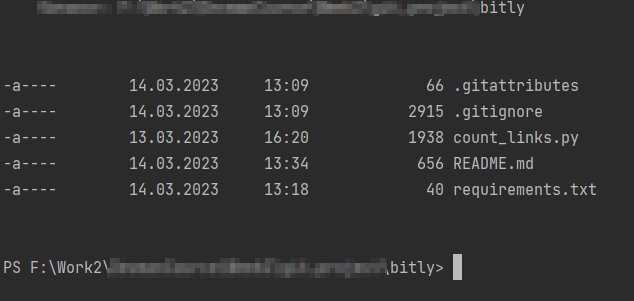

# Обрезка ссылок с помощью Битли

----------
Приложение используя сервис Bitly сокращает ссылку вида `bit.ly/number`.
Так же есть возможность проверить количество переходов по ссылке.


## Установка
1. На вашей целевой машине должен быть установлен `Python 3.10` [Сайт Python (установщик).](https://www.python.org/downloads/)
2. Зайти на сайт [Bitly](https://app.bitly.com). Зарегестрироваться, и получить Api-токен.

После установки, и клонирования репозитория к себе зайдите в папку проекта используя терминал( linux, macos), коммандную строку (win).



Далее устанавливаем [виртуальное окружение](https://docs.python.org/3/library/venv.html)

```commandline
virtualenv venv
```
Если линукс
```commandline Linux
source venv/bin/activare
```
Если Windows
```commandline
venv/Scripts/activate.ps1
```
Далее установка необходимых библиотек.
```commandline
pip install -r requirements.txt
```
## Запуск
После того, как все скачалось, в папке создаете файл `.env`, а в нем прописываете строку
`BITLINK_TOKEN = "Сюда вставляете ваш токен"`.
После 
```commandline
python count_links.py
```

Код написан в образовательных целях на онлайн-курсе для веб-разработчиков [dvmn.org](dvmn.org).